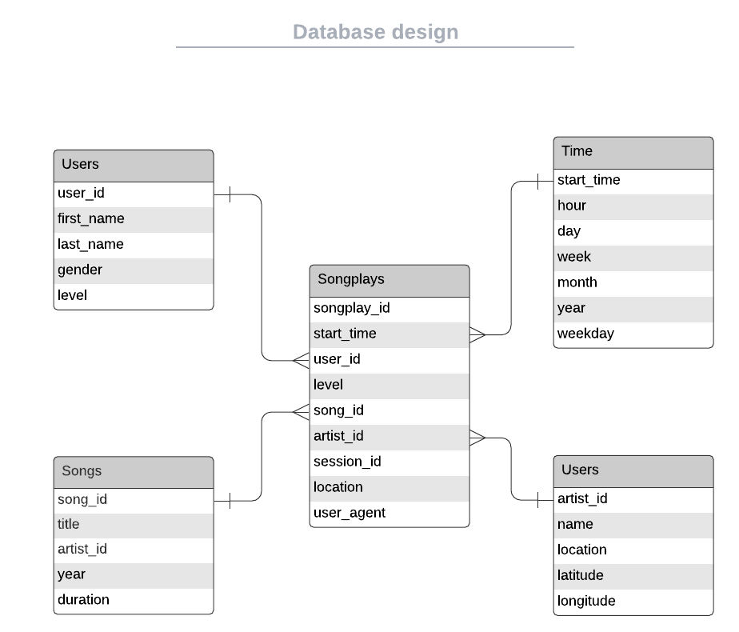

# Project 1
#Data modeling with PostgreSQL
## Udacity Data Engineering Nanodegree

Create a PostgreSQL database and build an ETL pipeline using Python. The data modeling follows a  star schema optimized for queries on song play analysis. The ETL pipeline transfers data from files in two local directories into the tables.

## Schema design and ETL pipeline

The star schema has 1 *fact* table (songplays), and 4 *dimension* tables (users, songs, artists, time). `DROP`, `CREATE`, `INSERT`, and `SELECT` queries are defined in **sql_queries.py**. **create_tables.py** uses functions `create_database`, `drop_tables`, and `create_tables` to create the database.

## Run the project

The file *create_tables.py* creates the necessary tables to hold the data. After running this file and creating the tables, the file *etl.py* has the code to transfer the data from the *data/* folder into the database.

## Files in the repository

* **sql_queries.py:** contains all the queries to `DROP`, `CREATE`, `INSERT`, and `SELECT` from tables in the database.
* **create_tables.py:** used to delete the tables and create them again using scripts contained in the *sql_queries.py*.
* **etl.ipynb:** exploration of the ETL process using a notebook. Just used for practice.
* **etl.py:** file with the code to run the ETL pipeline. It transfers the data from the JSON files to the database.
* **test.ipynb:** queries the tables in the database to make sure the data was loaded correctly.